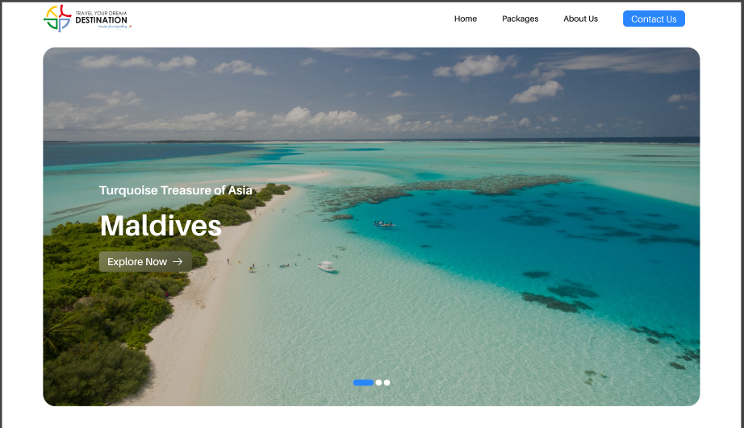

# TYDD (Travel Your Dream Destination)

## How to get started

- Clone the repo
  - `git clone https://github.com/akshay1502/tydd-frontend.git`
- Install all dependencies
  - `npm install`
- Running the project
  - `npm run dev`
- Find backend at
  - `https://github.com/akshay1502/tydd`

## Tech Stack used

- Nextjs
- [Payload cms](https://payloadcms.com/docs/getting-started/what-is-payload)
- Postgres by supabase
- Supabase storage
- vercel

## /src/app includes below folders

- **/(routes)** - frontend routes
- **/(api)** - APIs for handling form submissions

## Project working

- Know the **.env** variables required from [.env.example](https://github.com/akshay1502/tydd/blob/QA/.env.example) file
- Running `npm run dev` will start the server at `http://localhost:3000/`

## Miscellaneous

- Project uses `shadcn` and `tailwind` for rendering frontend UI elements
- `Nodemailer` is being used for sending mails
- Forms are handled using `react-hook-form` along with `zod` for validations
- `Swiper` is being used for serving multipel use cases
- `yet-another-react-lightbox` package for showcasing gallery
- `gsap` for animations
